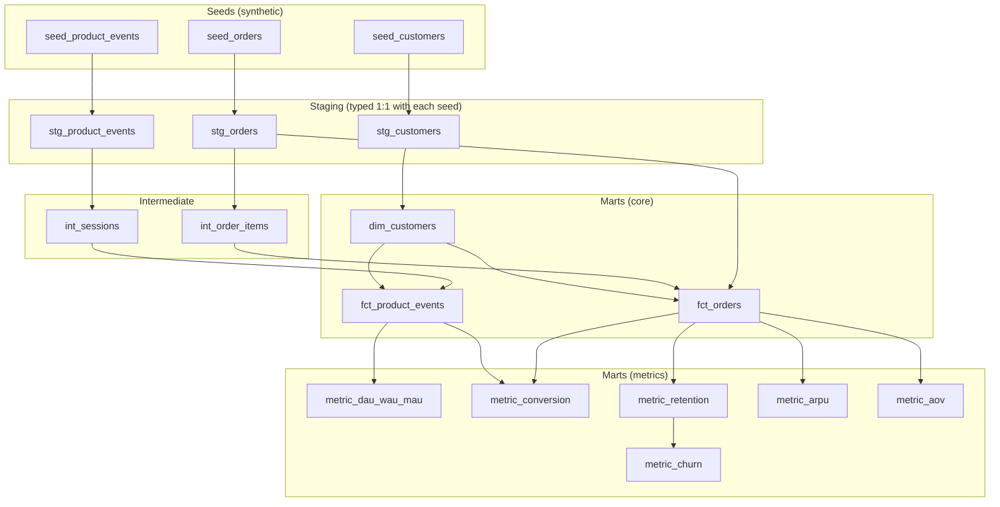

# Product Metrics Playbook

[](https://github.com/franciscovmcunha/product-metrics-playbook/actions/workflows/ci.yml)

An analytics engineering project that models core product metrics (DAU/WAU/MAU,
conversion, retention, churn, ARPU, and average order value) as tested, documented
dbt models instead of a written playbook.

## Why this isn't just a document

A metric definition that lives in a wiki page and a metric definition that lives in a
dbt model answer different questions. The wiki page can say "retention is the share of
customers who order again within 30 days," but it can't tell you whether that's
actually what today's number reflects, whether the underlying event data has gaps, or
whether someone quietly changed the window to 45 days six months ago without updating
the page. Modeling metrics in dbt means the definition and the number are the same
artifact, version-controlled and tested together.

## Layering



Each layer only depends on the layer directly below it: a metric model never reads
from staging directly, and a core mart never reads from a metric model. The one
exception is drawn above too. `metric_churn` reads `metric_retention`'s output
directly, since churn is retention's complement by definition (see
[`data_model.md`](docs/data_model.md)). That discipline keeps `dbt docs generate`'s
lineage graph readable as more metrics get added.

## What's in this repo

| Doc | Covers |
|---|---|
| [`metrics_glossary.md`](docs/metrics_glossary.md) | Exact definition of every metric this project computes |
| [`data_model.md`](docs/data_model.md) | The staging → intermediate → marts layering, and why |
| [`architecture.md`](docs/architecture.md) | How this differs from a metrics wiki, in practice |
| [`decisions/`](docs/decisions/) | Short ADRs for the trade-offs that mattered most |

## Stack

SQL, PostgreSQL, dbt (staging → intermediate → marts), Git.

## Running this project

Requires a local PostgreSQL instance and dbt with the Postgres adapter
(`pip install dbt-postgres`).

```bash
cp profiles.yml.example profiles.yml   # then fill in your local Postgres details
export DBT_PROFILES_DIR=.
dbt deps      # installs dbt_utils (see packages.yml)
dbt seed      # loads the three synthetic seeds
dbt run       # builds staging → intermediate → marts
dbt test      # 48 tests: schema tests + the amount/items reconciliation check
dbt docs generate && dbt docs serve   # browse the lineage graph
```

`profiles.yml` is gitignored and never committed. Only `profiles.yml.example` is.

## Status

Every model is implemented and passing `dbt test` end to end against the seeds. This
isn't a documented-but-empty scaffold: `dbt run` builds all 14 models (3 staging, 2
intermediate, 3 core, 6 metrics) and `dbt test` runs 48 tests clean.

---

Seed data under `seeds/` is entirely synthetic, generated by
[`seeds/generate_seeds.py`](seeds/generate_seeds.py) to exercise the model layering
above. None of it is sourced from any real product or company.

---

**Francisco Cunha** · Data Engineer / Analytics Engineer · [LinkedIn](https://linkedin.com/in/franciscovmcunha)
